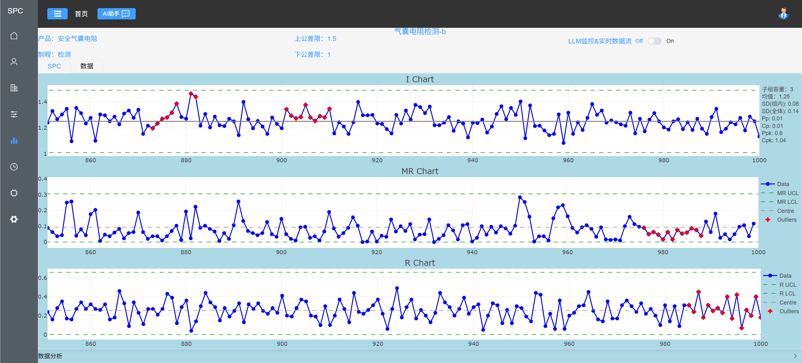
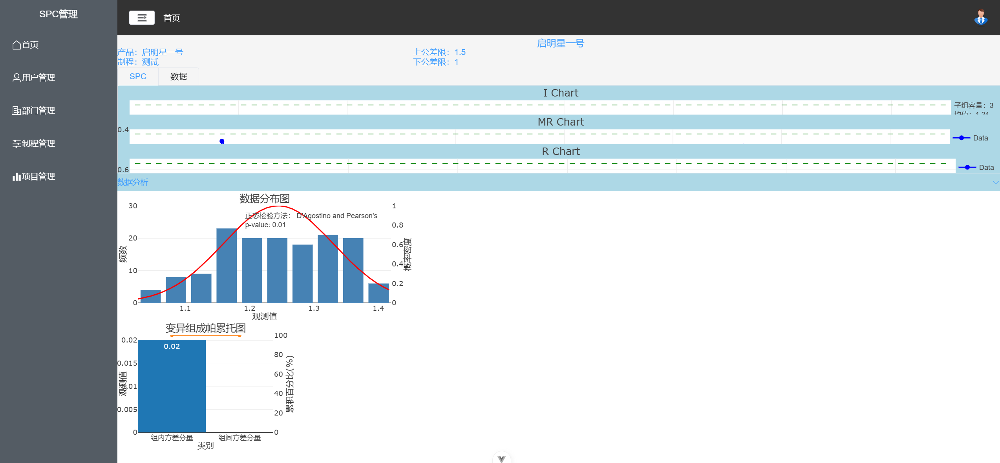

# WebSPC/webspc-frontend

# Project Introduction

SPC (Statistical Process Control) is widely used in production-quality management to monitor and control process variation, 

and to provide early warnings of abnormal conditions.

WebSPC is a web-based implementation of SPC. It adopts a front-end / back-end separation architecture and is free & open source.

Open-source repository:

Front-end business code address: https://gitee.com/valleyfo/webspc-frontend

General back-end business code address: https://gitee.com/valleyfo/webspc-backend

AI back-end business code address: https://gitee.com/valleyfo/webspc-ai

# Project Architecture

## Front-end:

Framework: Vue 3 + Vite + Pinia

UI: Element-Plus

Charting Library: Plotly.js

Language: TypeScript

# 1. How-to Videos

[1.1 WebSPC User Guide](https://www.bilibili.com/video/BV1h1XRYLEUt/?spm_id_from=333.1387.collection.video_card.click&vd_source=690fc386f07d30bd01bc5ca11d98ecf3)

[1.2 WebSPC Add-on: Automatic Data Collection](https://www.bilibili.com/video/BV1ANQbY9EpH?spm_id_from=333.788.recommend_more_video.1&vd_source=690fc386f07d30bd01bc5ca11d98ecf3)

# 2. Development Environment Setup

## 2.1 Clone
git clone https://gitee.com/valleyfo/webspc-frontend.git

## 2.2 Install Dependencies
npm install

## 2.3 Run Dev Server
npm run dev

## 2.4 Open in Browser
Ctrl + click the local link in the terminal to open the login page

# 3. Production Deployment

Videos

[3.1 WebSPC Deployment Part 1](https://www.bilibili.com/video/BV11RQAYWE82/?spm_id_from=333.1387.collection.video_card.click&vd_source=690fc386f07d30bd01bc5ca11d98ecf3)

[3.2 WebSPC Deployment Part 2](https://www.bilibili.com/video/BV1EmQwYgEJt/?spm_id_from=333.1387.collection.video_card.click&vd_source=690fc386f07d30bd01bc5ca11d98ecf3)

Supplement:Build Front-end

set MODE=production

npm run build

# 3.3 Preview

# 3.4 Special Thanks

The front-end of this mini-program was developed after studying the tutorials of Allen & Jason.

Some code snippets originate from their courses.

Tutorial channel: https://space.bilibili.com/1643315584

Many thanks to Allen & Jason and their team for the selfless sharing!

# 4. Live Demo

URL: https://webspc.top

Username: admin

Password: Contact the author

If this project has been helpful to you, why not buy the author a cup of coffee?

Scan the QR code below with Wexin to donate:

# 5. Technical Support

Author: Yu Wang

Email: wynmamtf@163.com

QQ: 271989251

Wexin: valleyfo

Note: Technical support includes but is not limited to:
Custom business development
Project deployment
Software usage explanations
Code explanations
SPC theory training
